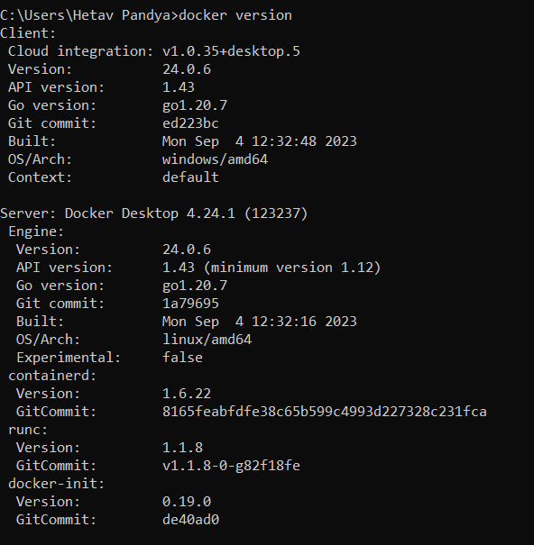

# ECE444-F2023-Lab3

## Activity 2
Output after successfull installation of Docker

## Activity 3
Local run of the website showing altered welcome message

## Activity 4
Image showing the Docker daemon running

Image of the website running locally of port 3000 (port 5000 was busy)
